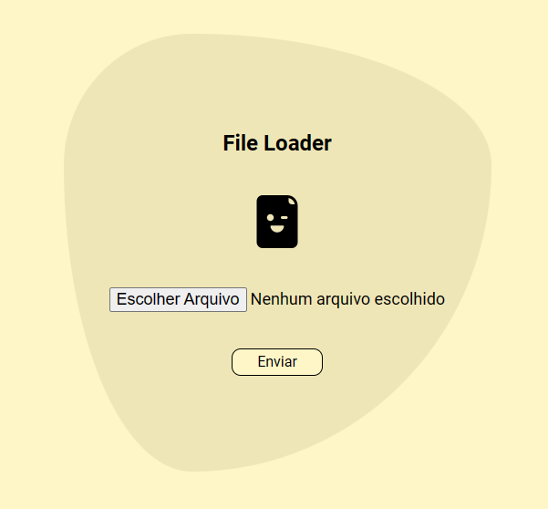
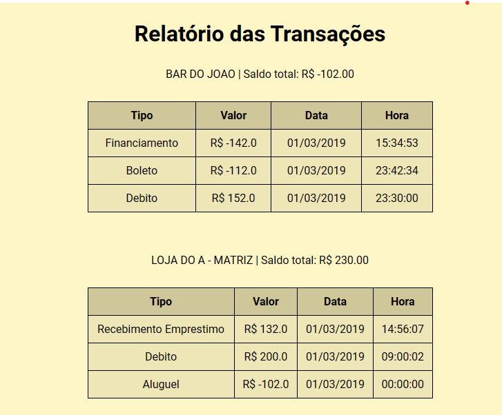

# desafio-python-cnab

Aplicação desenvolvida em python utilziando Flask que permite o upload de um arquivo, e apartir desse upload, cria um banco de dados e mostra informações em tela para o usuário:

                 

## Instalação

Primeiro, escolha um diretório local e inicie um repositório git como o seguinte comando: `git init`

Após isso, faça o clone do repositório: `git clone git@github.com:menezes-dev/desafio-python-cnab.git`

Em seguida, no repositório atual, crie um ambiente virtual, para instalar as dependências da aplicação: `python -m venv venv`

Agora, entre no ambiente virtual criado como o comando: `.\venv\Scripts\activate`

Uma vez no ambiente virtual, instale as dependências do projeto: `pip install -r requirements.txt`

## Execução

Após configurar o ambiente, rode o comando `python app.py` e acesse o seu localhost através do seu navegador, através do endereço `http://127.0.0.1:8000` ou `http://localhost:8000`
